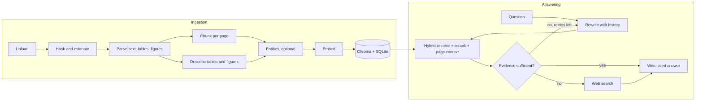

# DocSage — Multimodal Agentic Document Intelligence

> Ask questions across PDFs, Word files, slide decks, web pages and images. Get answers that cite
> the exact page, table or figure they came from, from an agent that checks its own evidence
> before it answers.


### Table of contents
* [What it does](#what-it-does)
* [Quick start](#quick-start)
* [Using DocSage](#using-docsage)
* [How it works](#how-it-works)
* [Models and providers](#models-and-providers)
* [Evaluation](#evaluation)
* [Configuration](#configuration)
* [Development](#development)

## What it does

- **Reads real documents.** PDF (plus EPUB and XPS), DOCX, PPTX (including native chart data and
  speaker notes), HTML, Markdown, TXT, CSV and images. Scanned pages go to the vision model.
- **Understands tables and figures.** Tables are kept as structured markdown with a cropped
  image. Charts and diagrams, raster or vector, are cropped, captioned from nearby text and
  described by a vision model so they become searchable.
- **Retrieves well.** Hybrid search (vectors + BM25 with reciprocal-rank fusion), optional model
  or cross-encoder re-ranking, page-level context expansion, filters by content type and
  document, and an experimental entity graph (GraphRAG).
- **Answers like an analyst.** A LangGraph agent rewrites follow-ups, searches, grades whether
  the evidence is enough, refines the search or falls back to the web, then writes an answer with
  inline citations. Every step streams live to the UI.
- **Stays cheap and predictable.** Uploads are estimated before ingestion. Per-document and
  per-question budgets stop runaway costs. Unchanged files are never re-processed.
- **Measures itself.** A golden-set evaluator compares chunking and retrieval configurations on
  hit rate, MRR, faithfulness, relevance, correctness, latency and cost.
- **Runs anywhere.** Claude, Gemini, OpenAI or local Ollama models behind one interface, and a
  fully offline mode that needs no API keys at all.

| Library | Overview | Evaluate |
|---|---|---|
|  |  |  |

## Quick start

Requirements: Python 3.11+, [uv](https://docs.astral.sh/uv/), Node 20+.

```bash
git clone https://github.com/bhanu-prakash920/DocSage.git docsage
cd docsage
cp sample.env .env            # add any keys you have; none are required
uv sync --extra local         # 'local' adds on-device embeddings; drop it for a slimmer install
(cd web && npm ci && npm run build)
uv run docsage serve          # http://127.0.0.1:8000
```

Open the app and choose **Load sample collection** to index a fictional annual report, field
guide, launch deck and runbook in a few seconds, complete with a golden question set.

With Docker:

```bash
docker compose up --build                    # http://localhost:8000
docker compose --profile local up --build    # also starts Ollama for local models
```

> **Offline mode.** With no API key DocSage still ingests, indexes, retrieves, evaluates and
> answers. Answers are extracted passages rather than generated prose, and figures are described
> from their captions. Add an Anthropic, Google or OpenAI key for the full experience.

## Using DocSage

### Web app

| Page | What you do there |
|---|---|
| **Ask** | Chat with a collection. Pick Agentic or Fast mode, filter by content type or document, allow web search, open any citation to see the source page, table crop or figure. Conversations are saved. |
| **Library** | Upload files, review the cost estimate, ingest, follow live progress, re-index or delete documents, and browse every chunk and extracted figure. |
| **Overview** | Index size and composition, questions per day, latency percentiles, spend, recent questions and jobs. |
| **Evaluate** | Build a golden set by hand, by JSON import or by generating questions from your documents, then benchmark configurations side by side. |
| **Settings** | Providers and models, chunking, retrieval defaults, budgets, theme and server token. |

### Command line

```bash
docsage ingest ./reports -c "Board packs" --chunking agentic   # add files (skips unchanged ones)
docsage ingest ./reports --dry-run                             # estimate calls and cost only
docsage ask -c "Board packs"                                   # interactive, streamed answers
docsage ask -c "Board packs" -q "What drove Q3 margin?"        # one question
docsage eval -c "Board packs" --presets dense,hybrid,agentic --chunking recursive,semantic
docsage samples | collections | status | serve
```

### HTTP API

Interactive documentation is served at `/api/docs`. Answers stream as server-sent events from
`POST /api/collections/{id}/query`. Set `DOCSAGE_API_TOKEN` to require a bearer token.

## How it works



**Chunking strategies**

| Strategy | Model calls | When to use it |
|---|---|---|
| `recursive` | none | Fast baseline. |
| `semantic` | embeddings only | Default. Splits where the topic shifts. |
| `agentic` | one per dense page | Titled, topic-coherent chunks. About 30x cheaper than `proposition`. |
| `proposition` | about two per sentence | Standalone-proposition chunker, kept for benchmarking. |

## Models and providers

`DOCSAGE_LLM_PROVIDER=auto` picks the first provider with a key, in this order. Every model ID can
be changed in Settings or `.env`.

| Provider | Answer model | Fast model (ingestion, grading) | Embeddings |
|---|---|---|---|
| Anthropic | `claude-opus-5-5` | `claude-haiku-4-5` | uses the next available embedding provider |
| Google | `gemini-flash-latest` | `gemini-flash-lite-latest` | `gemini-embedding-001` (768d) |
| OpenAI | `gpt-5.4` | `gpt-5.4-mini` | `text-embedding-3-small` |
| Ollama | `llama3.2-vision` | `llama3.2-vision` | `nomic-embed-text` |
| Offline | extractive | extractive | `BAAI/bge-base-en-v1.5` locally, or feature hashing |

Google defaults use rolling `-latest` aliases on purpose: pinned Gemini versions get shut down. Claude requests use the official Anthropic SDK with server-side
refusal fallbacks enabled on models that support them. Each collection remembers the embedding
model it was built with, so changing the default never corrupts an existing index.

## Evaluation

```bash
docsage eval -c sample-multimodal-demo --presets dense,hybrid,hybrid+rerank,agentic --chunking recursive,semantic
```

Each run writes a markdown summary and a JSON dump to `eval/results/`. Metrics:

- **Hit rate and MRR**: did retrieval return the expected document and page, and how high.
- **Faithfulness, relevance, correctness**: scored by a model judge, or by lexical heuristics offline.
- **Latency and cost** per configuration.

Smoke benchmark on the bundled sample corpus, offline mode, local embeddings
([full output](eval/results/)):

| Configuration | Hit rate | MRR | Faithfulness | Relevance | Latency (ms) |
|---|---|---|---|---|---|
| recursive / dense | 100% | 1.00 | 0.69 | 0.83 | 49 |
| recursive / hybrid | 100% | 1.00 | 0.70 | 0.83 | 48 |
| semantic / dense | 100% | 1.00 | 0.69 | 0.83 | 45 |
| semantic / agentic | 100% | 1.00 | 0.70 | 0.83 | 48 |

The sample corpus has only 19 chunks, so every configuration finds the right source first and
the table cannot separate them. It proves the harness works end to end. Meaningful comparisons
need your own corpus, a golden set of 30 or more questions, and an API key so answers are
generated and judged by a model.

## Configuration

Settings come from defaults, then environment variables with the `DOCSAGE_` prefix (see
[sample.env](sample.env)), then runtime changes saved from the Settings page to
`data/settings.json`. API keys are only ever read from the environment.

| Setting | Default | Notes |
|---|---|---|
| `DOCSAGE_LLM_PROVIDER` | `auto` | `anthropic`, `google`, `openai`, `ollama`, `offline` |
| `DOCSAGE_CHUNKING` | `semantic` | see the table above |
| `DOCSAGE_PARSER` | `pymupdf` | `llamaparse` and `docling` need their extras |
| `DOCSAGE_QUERY_MODE` | `agentic` | or `simple` |
| `DOCSAGE_TOP_K` | `6` | sources per answer |
| `DOCSAGE_RERANK` | `none` | `llm` or `cross-encoder` |
| `DOCSAGE_MAX_INGEST_COST_USD` | `2.0` | per document; 0 disables |
| `DOCSAGE_MAX_QUERY_COST_USD` | `0.25` | per question; 0 disables |
| `DOCSAGE_GRAPH_RAG` | `false` | entity graph, experimental |
| `DOCSAGE_DATA_DIR` | `data` | indexes, uploads, figures, SQLite |
| `DOCSAGE_API_TOKEN` | unset | require a bearer token |

Optional extras: `local` (sentence-transformers embeddings and cross-encoder), `ocr`
(img2table + EasyOCR for scanned tables), `llamaparse`, `docling`.

Set `LANGSMITH_TRACING=true` and `LANGSMITH_API_KEY` to trace every agent run in LangSmith.

## Development

```bash
uv sync --extra dev --extra local
uv run pytest                     # 37 backend tests, no network or keys needed
uv run ruff check docsage tests && uv run mypy docsage
cd web && npm ci
npm run dev                       # Vite on :5173, proxies /api to :8000
npm test && npm run typecheck
npm run qa                        # Playwright walkthrough at 4 viewports, light and dark
```

```
docsage/
  providers/   Claude, Gemini, OpenAI, Ollama and offline adapters, pricing, usage meter
  ingest/      parsers for each format, chunking strategies, pipeline, cost estimate
  retrieval/   hybrid retriever, fusion, re-ranking, parent expansion, web search
  agent/       LangGraph state machine and streaming query service
  eval/        golden-set runner and metrics
  store/       SQLite registry and Chroma vector store
  api/         FastAPI app
  prompts/     every prompt, versioned in the repo
web/           React + TypeScript UI
```

CI runs lint, type checks, both test suites, the frontend build and a Docker build on every
push. See [ROADMAP.md](ROADMAP.md) for what is next.
